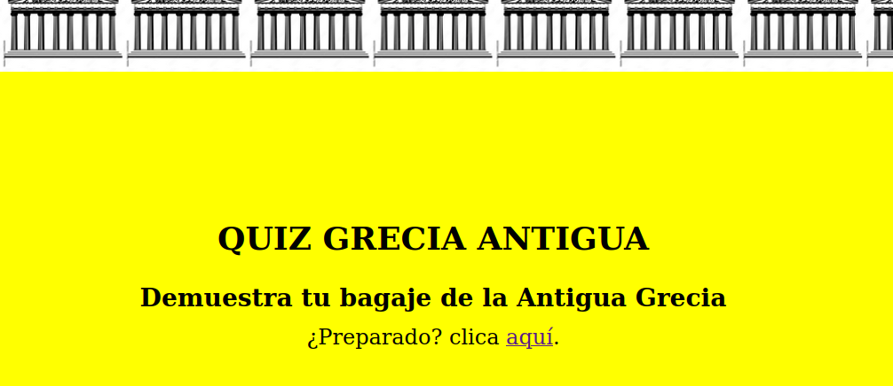
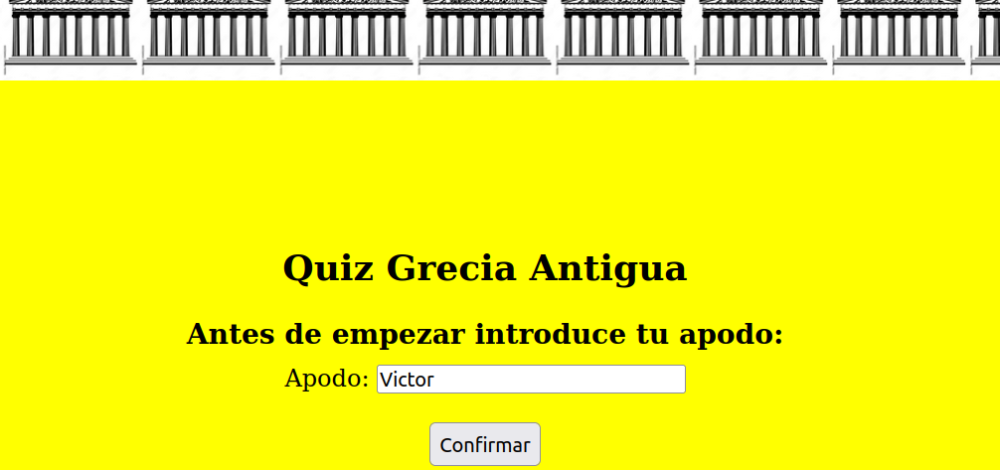
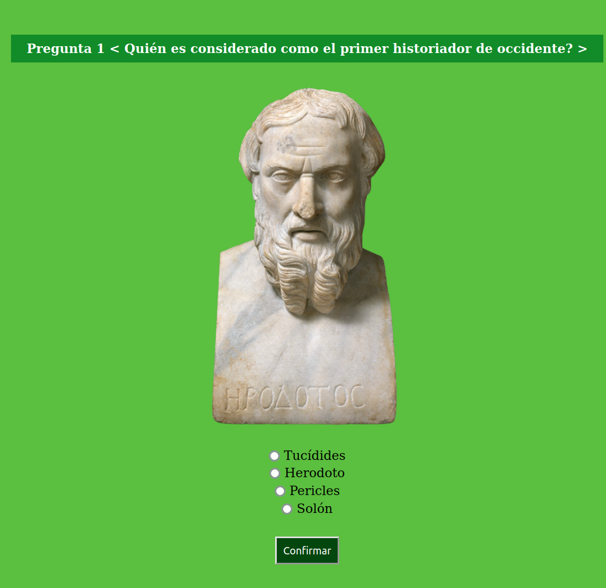
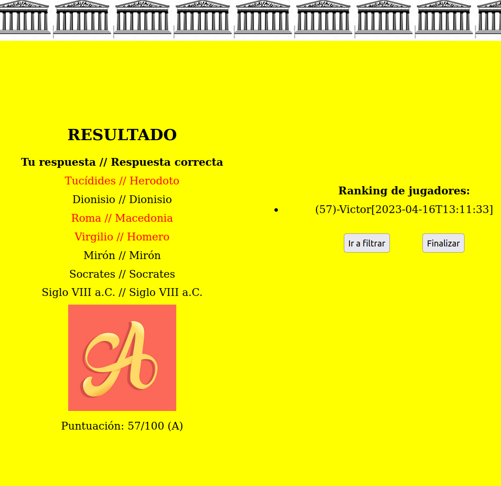

# sts4_spring_quizz

-Quizz about Ancient Greece based on Spring Tools Suite 4 and MySQL

-Includes an executable -jar

-Remember to set the 'application.properties' and other config to your needs

-Check it out:

